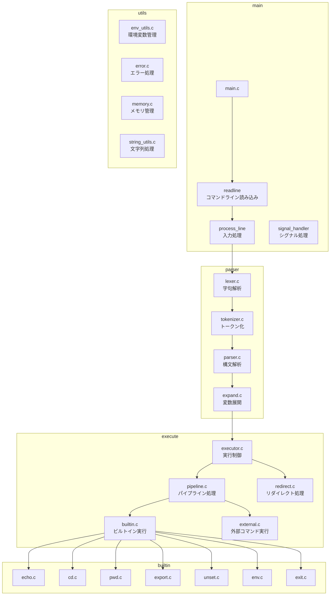
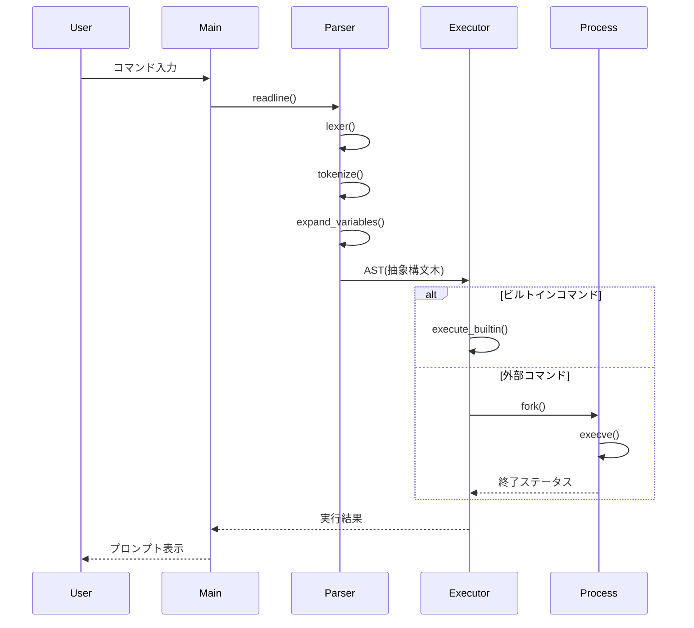

# module_diagram



## 階層型ディレクトリ構造

```
minishell/
│
├── Makefile
├── includes/
│   ├── minishell.h
│   ├── parser.h
│   ├── executor.h
│   └── builtin.h
│
├── srcs/
│   ├── main/
│   │   ├── main.c
│   │   ├── signal.c
│   │   └── prompt.c
│   │
│   ├── parser/
│   │   ├── lexer.c
│   │   ├── parser.c
│   │   ├── tokenizer.c
│   │   ├── expand.c
│   │   └── quotes.c
│   │
│   ├── executor/
│   │   ├── executor.c
│   │   ├── pipeline.c
│   │   ├── redirect.c
│   │   ├── process.c
│   │   └── path.c
│   │
│   ├── builtin/
│   │   ├── echo.c
│   │   ├── cd.c
│   │   ├── pwd.c
│   │   ├── export.c
│   │   ├── unset.c
│   │   ├── env.c
│   │   └── exit.c
│   │
│   └── utils/
│       ├── env_utils.c
│       ├── error.c
│       ├── memory.c
│       ├── string_utils.c
│       └── list_utils.c
│
└── libft/
    └── [libft files]
```

## 主要データフロー図

